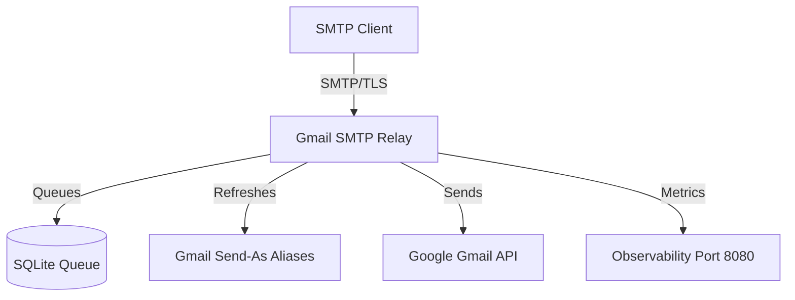

# Gmail SMTP Relay

A robust SMTP relay server that routes emails through the GMail API. It is designed to provide a secure and reliable way for local applications and services to send emails using GMail's infrastructure without exposing GMail credentials directly or relying on less secure "App Passwords."

## Features

- **SMTP Submission**: Supports SMTP over TLS (Port 465) and STARTTLS (Port 587).
- **GMail API Integration**: Uses official Google OAuth2 flow and GMail API for reliable delivery.
- **Local Queueing**: Employs an internal SQLite-backed queue to handle transient delivery failures and provide persistence.
- **Sender Validation**: Enforces sender policies using regex and validates against GMail's "Send-As" aliases.
- **Rate Limiting**: Includes built-in authentication rate limiting and lockout mechanisms.
- **Observability**: Exposes health checks and Prometheus-compatible metrics.
- **Robust Parsing**: Handles SMTP commands correctly, including protocol parameters like `SIZE`.

## Architecture



## Configuration

The application is configured primarily through environment variables (or a `.env` file).

| Variable | Description | Default |
|----------|-------------|---------|
| `SMTP_BIND_ADDR_465` | Interface and port for TLS SMTP | `:465` |
| `SMTP_BIND_ADDR_587` | Interface and port for STARTTLS SMTP | `:587` |
| `SMTP_HOSTNAME` | Hostname reported in SMTP banner | `gmail-smtp-relay` |
| `SMTP_AUTH_USERS_JSON` | JSON array of `{"username": "...", "password": "..."}` | **Required** |
| `ALLOWED_SENDER_REGEX` | Regular expression for permitted MAIL FROM addresses | `.*` |
| `GMAIL_CLIENT_ID` | Google OAuth2 Client ID | **Required** |
| `GMAIL_CLIENT_SECRET` | Google OAuth2 Client Secret | **Required** |
| `GMAIL_REFRESH_TOKEN` | Google OAuth2 Refresh Token | **Required** |
| `GMAIL_MAILBOX` | Primary GMail address associated with the account | **Required** |
| `TLS_CERT_FILE` | Path to TLS certificate | **Required** |
| `TLS_KEY_FILE` | Path to TLS private key | **Required** |
| `QUEUE_DB_PATH` | Path to the SQLite queue database | `./data/queue.db` |

## Building & Running

### Requirements
- Go 1.25+
- Docker (optional)

### Build Locally
```bash
go build -o smtp-relay ./cmd/smtp-relay
```

### Build Docker Image
```bash
docker build -t gmail-smtp-relay:latest .
```

### Run with Docker Compose
```yaml
services:
  gmail-smtp-relay:
    image: gmail-smtp-relay:latest
    ports:
      - "465:465"
      - "587:587"
    env_file: .env
    volumes:
      - ./data:/app/data
      - ./certs:/certs:ro
```

## SMTP Usage

Connect your application to the relay using the configured `SMTP_AUTH_USERS_JSON` credentials.

**Example (Python):**
```python
import smtplib
from email.message import EmailMessage

msg = EmailMessage()
msg.set_content("Hello from Gmail SMTP Relay!")
msg["Subject"] = "Relay Test"
msg["From"] = "noreply@yourdomain.com"
msg["To"] = "target@example.com"

with smtplib.SMTP("relay-host", 587) as server:
    server.starttls()
    server.login("your-username", "your-password")
    server.send_message(msg)
```

## License
MIT
